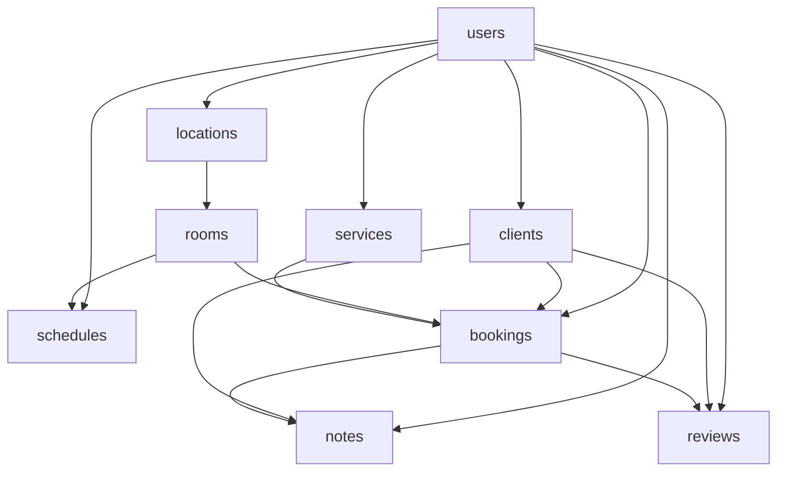

# PocketBase Demo Data Import Guide

This guide will help you import the demo data into your PocketBase instance for the massage parlor management system.

## 📋 Demo Data Overview

### Users Collection (5 users)
- **Administrator**: Sarah Admin (admin@massage.com)
- **Operator**: Mark Operator (operator@massage.com)  
- **Therapists**: Anna, Petra, Maria (massage1-3@massage.com)

### Business Data
- **3 Locations**: Prague, Brno, Ostrava
- **6 Rooms**: Various types with different amenities
- **10 Services**: Complete massage and wellness services
- **6 Clients**: Mix of communication channels and languages
- **5 Schedules**: Different time slots and availability
- **5 Bookings**: Various statuses and services
- **5 Notes**: Client feedback and observations
- **5 Reviews**: Customer reviews with ratings

## 🔧 Import Methods

### Method 1: PocketBase Admin UI (Recommended)

1. **Start PocketBase Server**
   ```bash
   ./pocketbase serve
   ```

2. **Access Admin UI**
   - Open http://127.0.0.1:8090/_/
   - Create admin account if first time

3. **Import Collections (In Order)**

   #### Step 1: Import Users
   - Go to Collections → users
   - Click "Import records"
   - Copy user data from `demo-data.json`
   - Import each user manually or use JSON import
   - **Default passwords**: admin123456, operator123456, user123456

   #### Step 2: Import Locations
   - Go to Collections → locations
   - Import location data
   - Note the generated IDs for rooms

   #### Step 3: Import Rooms
   - Go to Collections → rooms
   - Import room data
   - **Important**: Update `location_id` with actual location IDs
   - Update `created_by` with actual user ID

   #### Step 4: Import Services
   - Go to Collections → services
   - Import service data
   - Update `created_by` with actual user ID

   #### Step 5: Import Clients
   - Go to Collections → clients
   - Import client data
   - Update `created_by` and `blocked_by` with actual user IDs

   #### Step 6: Import Schedules
   - Go to Collections → schedules
   - Import schedule data
   - **Important**: Update dates to current/future dates
   - Update `user_id` and `room_id` with actual IDs
   - Update `confirmed_by` and `created_by` with actual user IDs

   #### Step 7: Import Bookings
   - Go to Collections → bookings
   - Import booking data
   - **Important**: Update dates to current/future dates
   - Update all relation IDs: `client_id`, `user_id`, `room_id`, `service_id`
   - Update `created_by`, `confirmed_by`, `cancelled_by` with actual user IDs

   #### Step 8: Import Notes
   - Go to Collections → notes
   - Import note data
   - Update `client_id`, `user_id`, `booking_id` with actual IDs

   #### Step 9: Import Reviews
   - Go to Collections → reviews
   - Import review data
   - Update `booking_id`, `client_id`, `user_id`, `responded_by` with actual IDs

### Method 2: API Import (Advanced)

Use the PocketBase SDK or direct API calls to import data programmatically.

```javascript
// Example using PocketBase JavaScript SDK
import PocketBase from 'pocketbase';

const pb = new PocketBase('http://127.0.0.1:8090');

// Authenticate as admin
await pb.admins.authWithPassword('admin@example.com', 'password');

// Import data
const demoData = require('./demo-data.json');

// Import users first
for (const user of demoData.users) {
    await pb.collection('users').create(user);
}

// Continue with other collections...
```

## ⚠️ Important Considerations

### 1. Relation IDs
- PocketBase generates unique IDs for each record
- You must update relation fields with actual generated IDs
- Keep track of created record IDs for updating relations

### 2. Dates
- Update all date fields to current or future dates
- Format: YYYY-MM-DD for dates
- Format: YYYY-MM-DDTHH:mm:ssZ for datetime

### 3. Authentication
- Users need to verify their emails or set `verified: true`
- Update the `emailVisibility` setting if needed

### 4. File Uploads
- Avatar images need to be uploaded separately
- Use the file upload API or admin interface

### 5. Collection Dependencies


## 🎯 Demo Credentials

After import, you can log in with:

| Role | Email | Password |
|------|--------|----------|
| Administrator | admin@massage.com | admin123456 |
| Operator | operator@massage.com | operator123456 |
| Therapist | massage1@massage.com | user123456 |
| Therapist | massage2@massage.com | user123456 |
| Therapist | massage3@massage.com | user123456 |

## 🧪 Testing the System

After importing the demo data:

1. **Test Authentication**
   - Log in with different user roles
   - Verify role-based access controls

2. **Test Booking Flow**
   - Create new bookings
   - Update existing bookings
   - Test PIN code functionality

3. **Test Client Management**
   - Add new clients
   - Update client information
   - Test blocking/unblocking

4. **Test Schedule Management**
   - Create therapist schedules
   - Update availability
   - Test room assignments

5. **Test Reviews & Notes**
   - Add client notes
   - Respond to reviews
   - Test privacy settings

## 🔄 Updating Relations

When importing via Admin UI, you'll need to manually update relation fields:

1. Import the main records first
2. Note down the generated IDs
3. Go back and edit records to add proper relation IDs
4. Verify all relationships are working

## 📝 Customization

Feel free to modify the demo data:
- Add more users, clients, services
- Update business information (names, addresses)
- Adjust pricing and schedules
- Add custom fields and data

The demo data provides a solid foundation for testing and development of your massage parlor management system!
